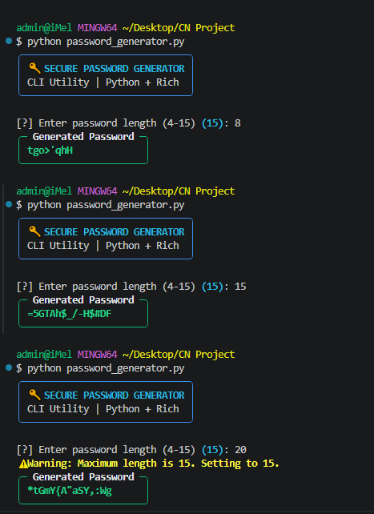
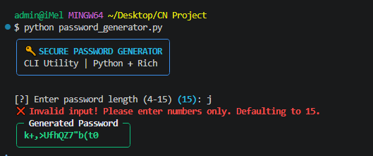

# 🔑 Module 02: Secure Password Generator




A CLI utility for generating customizable, high-entropy passwords with terminal styling powered by `rich`.

## 🚀 Features
* **Custom Length:** Allows user-defined length or defaults to 15 characters.
* **Character Diversity:** Combines uppercase, lowercase, numbers, and special symbols.
* **Interactive UI:** Formatted output panels with dynamic terminal prompts using `rich`.

## 🛠️ Prerequisites
* **Python 3.x**
* Python Libraries: `rich`

## 💻 Usage
```bash
python password_generator.py
