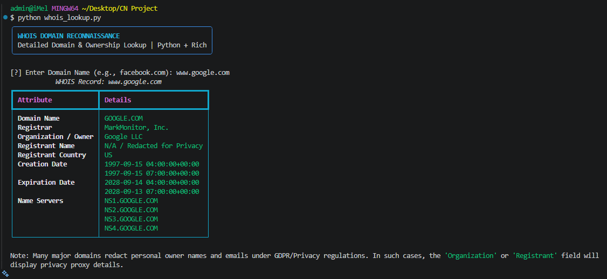

# 🔍 Module 03: Automated WHOIS Lookup Utility



A lightweight reconnaissance tool that directly opens a TCP socket connection to IANA's WHOIS servers on Port 43 to retrieve domain registry and delegation data.

## 🚀 Features
* **Low-Level Sockets:** Interacts directly with `whois.iana.org` on Port 43 without heavy third-party domain wrappers.
* **Timeout Protection:** Built-in connection timeouts to handle unresponsive hosts gracefully.
* **Rich Display:** Renders raw domain allocation records inside clean terminal panels using `rich`.

## 🛠️ Prerequisites
* **Python 3.x**
* Python Libraries: `rich`

## 💻 Usage
```bash
python whois_lookup.py
